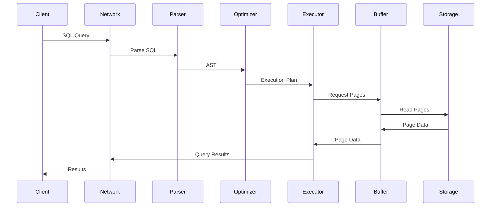
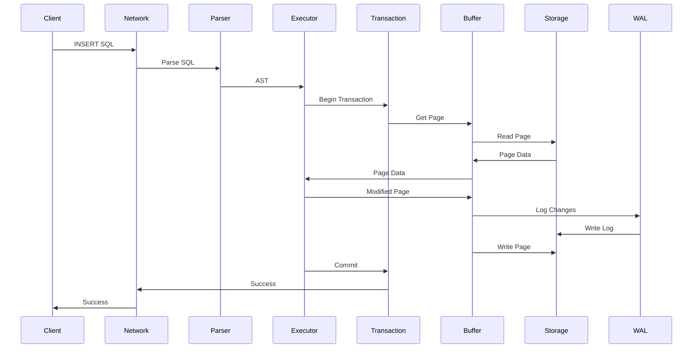

# RustDB Architecture Guide

## 🏗️ Architecture Overview

RustDB is a high-performance database management system built on principles of modularity, scalability, and reliability. The system architecture follows microservices and event-driven architecture principles.

## 🎯 Design Principles

### Core Principles

1. **Modularity**: The system is divided into independent modules with clear interfaces
2. **Scalability**: The architecture supports horizontal and vertical scaling
3. **Reliability**: Use of ACID transactions and recovery mechanisms
4. **Performance**: Optimization for high-load scenarios
5. **Security**: Multi-level security and authentication system

### Architectural Patterns

- **Layered Architecture**: Separation into layers with clear boundaries
- **Event Sourcing**: Storing all changes as a sequence of events
- **CQRS**: Separation of commands and queries for optimization
- **Repository Pattern**: Data access abstraction
- **Factory Pattern**: Creation of complex objects

## 🏛️ High-Level Architecture

```
┌─────────────────────────────────────────────────────────────┐
│                    Client Applications                      │
│              (Web, Mobile, Desktop, CLI)                  │
└─────────────────────────────────────────────────────────────┘
                              │
                              ▼
┌─────────────────────────────────────────────────────────────┐
│                    Network Layer                           │
│              (TCP, HTTP, gRPC, WebSocket)                 │
└─────────────────────────────────────────────────────────────┘
                              │
                              ▼
┌─────────────────────────────────────────────────────────────┐
│                  Authentication &                          │
│                  Authorization Layer                        │
└─────────────────────────────────────────────────────────────┘
                              │
                              ▼
┌─────────────────────────────────────────────────────────────┐
│                    Query Parser                            │
│              (SQL Parsing & Validation)                    │
└─────────────────────────────────────────────────────────────┘
                              │
                              ▼
┌─────────────────────────────────────────────────────────────┐
│                  Query Optimizer                           │
│              (Execution Plan Generation)                   │
└─────────────────────────────────────────────────────────────┘
                              │
                              ▼
┌─────────────────────────────────────────────────────────────┐
│                    Query Executor                          │
│              (Plan Execution & Results)                    │
└─────────────────────────────────────────────────────────────┘
                              │
                              ▼
┌─────────────────────────────────────────────────────────────┐
│                  Transaction Manager                        │
│              (ACID, Concurrency Control)                   │
└─────────────────────────────────────────────────────────────┘
                              │
                              ▼
┌─────────────────────────────────────────────────────────────┐
│                    Storage Layer                            │
│              (Pages, Indexes, WAL)                         │
└─────────────────────────────────────────────────────────────┘
                              │
                              ▼
┌─────────────────────────────────────────────────────────────┐
│                    Buffer Manager                           │
│              (LRU Cache, Page Management)                  │
└─────────────────────────────────────────────────────────────┘
                              │
                              ▼
┌─────────────────────────────────────────────────────────────┐
│                    File System                              │
│              (OS File Operations)                           │
└─────────────────────────────────────────────────────────────┘
```

## 🔧 Detailed Module Architecture

### 1. Network Layer

```rust
pub mod network {
    use tokio::net::{TcpListener, TcpStream};
    use tokio::sync::mpsc;
    use std::sync::Arc;

    /// Main database server
    pub struct DatabaseServer {
        listener: TcpListener,
        connection_pool: Arc<ConnectionPool>,
        query_processor: Arc<QueryProcessor>,
    }

    /// Connection pool for managing client connections
    pub struct ConnectionPool {
        connections: Arc<Mutex<HashMap<ConnectionId, Connection>>>,
        max_connections: usize,
        connection_timeout: Duration,
    }

    /// Client connection handler
    pub struct ConnectionHandler {
        stream: TcpStream,
        buffer: Vec<u8>,
        query_sender: mpsc::Sender<Query>,
        result_receiver: mpsc::Receiver<QueryResult>,
    }

    impl DatabaseServer {
        /// Start server
        pub async fn run(&self) -> Result<(), ServerError> {
            loop {
                let (socket, addr) = self.listener.accept().await?;
                let connection_id = ConnectionId::new();
                
                let handler = ConnectionHandler::new(
                    socket,
                    connection_id,
                    self.query_processor.clone(),
                );
                
                tokio::spawn(async move {
                    if let Err(e) = handler.handle().await {
                        error!("Connection error: {:?}", e);
                    }
                });
            }
        }
    }
}
```

### 2. Authentication & Authorization

```rust
pub mod auth {
    use argon2::{self, Config};
    use jsonwebtoken::{decode, encode, Header, Validation};
    use serde::{Deserialize, Serialize};

    /// System user
    #[derive(Debug, Clone, Serialize, Deserialize)]
    pub struct User {
        pub id: UserId,
        pub username: String,
        pub password_hash: String,
        pub role: UserRole,
        pub permissions: Vec<Permission>,
        pub created_at: DateTime<Utc>,
        pub last_login: Option<DateTime<Utc>>,
    }

    /// User roles
    #[derive(Debug, Clone, Serialize, Deserialize)]
    pub enum UserRole {
        Administrator,
        Regular,
        ReadOnly,
        Developer,
    }

    /// Access permissions
    #[derive(Debug, Clone, Serialize, Deserialize)]
    pub enum Permission {
        Select { table: String },
        Insert { table: String },
        Update { table: String },
        Delete { table: String },
        Create { resource_type: ResourceType },
        Drop { resource_type: ResourceType },
        Grant { permission: Box<Permission> },
        Revoke { permission: Box<Permission> },
    }

    /// Authentication manager
    pub struct AuthManager {
        user_repository: Arc<dyn UserRepository>,
        jwt_secret: String,
        session_store: Arc<SessionStore>,
    }

    impl AuthManager {
        /// User authentication
        pub async fn authenticate(
            &self,
            username: &str,
            password: &str,
        ) -> Result<AuthToken, AuthError> {
            let user = self.user_repository.find_by_username(username).await?;
            
            if !self.verify_password(password, &user.password_hash)? {
                return Err(AuthError::InvalidCredentials);
            }
            
            let token = self.generate_token(&user)?;
            self.session_store.store_session(&token, &user).await?;
            
            Ok(token)
        }

        /// Permission check
        pub async fn check_permission(
            &self,
            token: &AuthToken,
            permission: &Permission,
        ) -> Result<bool, AuthError> {
            let user = self.get_user_from_token(token).await?;
            Ok(self.user_has_permission(&user, permission))
        }
    }
}
```

### 3. Query Parser

```rust
pub mod parser {
    use nom::{branch::alt, bytes::complete::tag, combinator::map, sequence::tuple};

    /// SQL query abstract syntax tree
    #[derive(Debug, Clone)]
    pub enum SqlStatement {
        Select(SelectStatement),
        Insert(InsertStatement),
        Update(UpdateStatement),
        Delete(DeleteStatement),
        CreateTable(CreateTableStatement),
        AlterTable(AlterTableStatement),
        DropTable(DropTableStatement),
        BeginTransaction,
        Commit,
        Rollback,
    }

    /// SELECT query
    #[derive(Debug, Clone)]
    pub struct SelectStatement {
        pub columns: Vec<SelectColumn>,
        pub from: Vec<TableReference>,
        pub where_clause: Option<Expression>,
        pub group_by: Vec<Expression>,
        pub having: Option<Expression>,
        pub order_by: Vec<OrderByClause>,
        pub limit: Option<u64>,
        pub offset: Option<u64>,
    }

    /// SQL parser
    pub struct SqlParser {
        lexer: Lexer,
        ast_builder: AstBuilder,
    }

    impl SqlParser {
        /// Parse SQL query
        pub fn parse(&self, sql: &str) -> Result<SqlStatement, ParseError> {
            let tokens = self.lexer.tokenize(sql)?;
            let ast = self.ast_builder.build_ast(&tokens)?;
            Ok(ast)
        }

        /// SQL query validation
        pub fn validate(&self, statement: &SqlStatement) -> Result<(), ValidationError> {
            match statement {
                SqlStatement::Select(select) => self.validate_select(select),
                SqlStatement::Insert(insert) => self.validate_insert(insert),
                SqlStatement::Update(update) => self.validate_update(update),
                SqlStatement::Delete(delete) => self.validate_delete(delete),
                _ => Ok(()),
            }
        }
    }
}
```

### 4. Query Optimizer

```rust
pub mod optimizer {
    use std::collections::HashMap;

    /// Query execution plan
    #[derive(Debug, Clone)]
    pub struct ExecutionPlan {
        pub root: PlanNode,
        pub estimated_cost: f64,
        pub estimated_rows: u64,
        pub statistics: PlanStatistics,
    }

    /// Execution plan node
    #[derive(Debug, Clone)]
    pub enum PlanNode {
        TableScan {
            table_name: String,
            filter: Option<Expression>,
            estimated_rows: u64,
        },
        IndexScan {
            index_name: String,
            table_name: String,
            filter: Option<Expression>,
            estimated_rows: u64,
        },
        HashJoin {
            left: Box<PlanNode>,
            right: Box<PlanNode>,
            join_condition: Expression,
            join_type: JoinType,
        },
        NestedLoopJoin {
            left: Box<PlanNode>,
            right: Box<PlanNode>,
            join_condition: Expression,
            join_type: JoinType,
        },
        Sort {
            child: Box<PlanNode>,
            sort_keys: Vec<SortKey>,
        },
        Aggregate {
            child: Box<PlanNode>,
            group_by: Vec<Expression>,
            aggregates: Vec<AggregateFunction>,
        },
    }

    /// Query optimizer
    pub struct QueryOptimizer {
        statistics_collector: Arc<StatisticsCollector>,
        cost_model: Arc<CostModel>,
        rule_engine: Arc<RuleEngine>,
    }

    impl QueryOptimizer {
        /// Execution plan optimization
        pub fn optimize(&self, plan: ExecutionPlan) -> Result<ExecutionPlan, OptimizerError> {
            let mut optimized_plan = plan;
            
            // Apply optimization rules
            optimized_plan = self.rule_engine.apply_rules(optimized_plan)?;
            
            // Reorder JOIN operations
            optimized_plan = self.optimize_join_order(optimized_plan)?;
            
            // Index selection
            optimized_plan = self.select_indexes(optimized_plan)?;
            
            // Cost estimation
            optimized_plan.estimated_cost = self.cost_model.estimate_cost(&optimized_plan.root);
            
            Ok(optimized_plan)
        }

        /// JOIN order optimization
        fn optimize_join_order(&self, plan: ExecutionPlan) -> Result<ExecutionPlan, OptimizerError> {
            // Implementation of dynamic programming algorithm
            // for optimizing JOIN operation order
            Ok(plan)
        }
    }
}
```

### 5. Query Executor

```rust
pub mod executor {
    use tokio::sync::mpsc;
    use std::sync::Arc;

    /// Query executor
    pub struct QueryExecutor {
        plan_executor: Arc<PlanExecutor>,
        result_formatter: Arc<ResultFormatter>,
        error_handler: Arc<ErrorHandler>,
    }

    /// Execution plan executor
    pub struct PlanExecutor {
        operators: HashMap<OperatorType, Box<dyn Operator>>,
        memory_manager: Arc<MemoryManager>,
    }

    /// Base trait for operators
    pub trait Operator: Send + Sync {
        fn execute(&self, input: OperatorInput) -> Result<OperatorOutput, ExecutionError>;
        fn get_schema(&self) -> Schema;
        fn estimate_cost(&self) -> f64;
    }

    /// Table scan operator
    pub struct TableScanOperator {
        table_name: String,
        filter: Option<Expression>,
        buffer_manager: Arc<BufferManager>,
    }

    impl Operator for TableScanOperator {
        fn execute(&self, input: OperatorInput) -> Result<OperatorOutput, ExecutionError> {
            let mut rows = Vec::new();
            let table = self.buffer_manager.get_table(&self.table_name)?;
            
            for page in table.pages() {
                for row in page.rows() {
                    if let Some(ref filter) = self.filter {
                        if self.evaluate_filter(row, filter)? {
                            rows.push(row.clone());
                        }
                    } else {
                        rows.push(row.clone());
                    }
                }
            }
            
            Ok(OperatorOutput::Rows(rows))
        }
    }

    /// JOIN operator
    pub struct HashJoinOperator {
        left_child: Box<dyn Operator>,
        right_child: Box<dyn Operator>,
        join_condition: Expression,
        join_type: JoinType,
        hash_table: HashMap<Value, Vec<Row>>,
    }

    impl Operator for HashJoinOperator {
        fn execute(&self, input: OperatorInput) -> Result<OperatorOutput, ExecutionError> {
            // Build hash table for left subtree
            let left_output = self.left_child.execute(input)?;
            let left_rows = left_output.into_rows()?;
            
            for row in left_rows {
                let key = self.extract_join_key(&row, &self.join_condition)?;
                self.hash_table.entry(key).or_insert_with(Vec::new).push(row);
            }
            
            // Join with right subtree
            let right_output = self.right_child.execute(input)?;
            let right_rows = right_output.into_rows()?;
            
            let mut result_rows = Vec::new();
            for right_row in right_rows {
                let key = self.extract_join_key(&right_row, &self.join_condition)?;
                
                if let Some(left_matches) = self.hash_table.get(&key) {
                    for left_row in left_matches {
                        let joined_row = self.join_rows(left_row, &right_row)?;
                        result_rows.push(joined_row);
                    }
                }
            }
            
            Ok(OperatorOutput::Rows(result_rows))
        }
    }
}
```

### 6. Transaction Manager

```rust
pub mod transaction {
    use std::collections::HashMap;
    use tokio::sync::RwLock;
    use uuid::Uuid;

    /// Transaction manager
    pub struct TransactionManager {
        active_transactions: Arc<RwLock<HashMap<TransactionId, ActiveTransaction>>>,
        lock_manager: Arc<LockManager>,
        log_manager: Arc<LogManager>,
        recovery_manager: Arc<RecoveryManager>,
    }

    /// Active transaction
    pub struct ActiveTransaction {
        pub id: TransactionId,
        pub state: TransactionState,
        pub start_time: DateTime<Utc>,
        pub locks: Vec<Lock>,
        pub log_records: Vec<LogRecord>,
        pub isolation_level: IsolationLevel,
    }

    /// Transaction state
    #[derive(Debug, Clone)]
    pub enum TransactionState {
        Active,
        Committed,
        Aborted,
        Preparing,
    }

    /// Isolation levels
    #[derive(Debug, Clone)]
    pub enum IsolationLevel {
        ReadUncommitted,
        ReadCommitted,
        RepeatableRead,
        Serializable,
    }

    impl TransactionManager {
        /// Start new transaction
        pub async fn begin_transaction(
            &self,
            isolation_level: IsolationLevel,
        ) -> Result<TransactionId, TransactionError> {
            let transaction_id = TransactionId::new();
            let transaction = ActiveTransaction {
                id: transaction_id,
                state: TransactionState::Active,
                start_time: Utc::now(),
                locks: Vec::new(),
                log_records: Vec::new(),
                isolation_level,
            };
            
            self.active_transactions.write().await.insert(transaction_id, transaction);
            self.log_manager.log_transaction_begin(transaction_id).await?;
            
            Ok(transaction_id)
        }

        /// Commit transaction
        pub async fn commit_transaction(
            &self,
            transaction_id: TransactionId,
        ) -> Result<(), TransactionError> {
            let mut transactions = self.active_transactions.write().await;
            
            if let Some(transaction) = transactions.get_mut(&transaction_id) {
                // Deadlock check
                if self.lock_manager.has_deadlock(transaction_id).await? {
                    return Err(TransactionError::DeadlockDetected);
                }
                
                // Write to WAL
                self.log_manager.log_transaction_commit(transaction_id).await?;
                
                // Release locks
                for lock in &transaction.locks {
                    self.lock_manager.release_lock(lock).await?;
                }
                
                transaction.state = TransactionState::Committed;
                transactions.remove(&transaction_id);
                
                Ok(())
            } else {
                Err(TransactionError::TransactionNotFound)
            }
        }

        /// Rollback transaction
        pub async fn rollback_transaction(
            &self,
            transaction_id: TransactionId,
        ) -> Result<(), TransactionError> {
            let mut transactions = self.active_transactions.write().await;
            
            if let Some(transaction) = transactions.get_mut(&transaction_id) {
                // Write to WAL
                self.log_manager.log_transaction_abort(transaction_id).await?;
                
                // Rollback changes
                for log_record in transaction.log_records.iter().rev() {
                    self.recovery_manager.undo_operation(log_record).await?;
                }
                
                // Release locks
                for lock in &transaction.locks {
                    self.lock_manager.release_lock(lock).await?;
                }
                
                transaction.state = TransactionState::Aborted;
                transactions.remove(&transaction_id);
                
                Ok(())
            } else {
                Err(TransactionError::TransactionNotFound)
            }
        }
    }
}
```

### 7. Storage Layer

```rust
pub mod storage {
    use std::collections::BTreeMap;
    use serde::{Deserialize, Serialize};

    /// Page manager
    pub struct PageManager {
        page_size: usize,
        free_pages: Vec<PageId>,
        page_map: BTreeMap<PageId, Page>,
        file_manager: Arc<FileManager>,
    }

    /// Data page
    #[derive(Debug, Clone, Serialize, Deserialize)]
    pub struct Page {
        pub id: PageId,
        pub header: PageHeader,
        pub data: Vec<u8>,
        pub free_space: usize,
        pub record_count: u32,
        pub next_page: Option<PageId>,
        pub prev_page: Option<PageId>,
    }

    /// Page header
    #[derive(Debug, Clone, Serialize, Deserialize)]
    pub struct PageHeader {
        pub page_type: PageType,
        pub checksum: u32,
        pub lsn: LogSequenceNumber,
        pub flags: PageFlags,
    }

    /// Page types
    #[derive(Debug, Clone, Serialize, Deserialize)]
    pub enum PageType {
        Data,
        Index,
        FreeSpace,
        System,
    }

    impl PageManager {
        /// Create new page
        pub async fn create_page(&mut self, page_type: PageType) -> Result<PageId, StorageError> {
            let page_id = if let Some(id) = self.free_pages.pop() {
                id
            } else {
                self.allocate_new_page().await?
            };
            
            let page = Page {
                id: page_id,
                header: PageHeader {
                    page_type,
                    checksum: 0,
                    lsn: LogSequenceNumber::new(),
                    flags: PageFlags::empty(),
                },
                data: vec![0; self.page_size],
                free_space: self.page_size - PageHeader::size(),
                record_count: 0,
                next_page: None,
                prev_page: None,
            };
            
            self.page_map.insert(page_id, page);
            self.file_manager.write_page(page_id, &page).await?;
            
            Ok(page_id)
        }

        /// Read page
        pub async fn read_page(&self, page_id: PageId) -> Result<Page, StorageError> {
            if let Some(page) = self.page_map.get(&page_id) {
                Ok(page.clone())
            } else {
                let page = self.file_manager.read_page(page_id).await?;
                Ok(page)
            }
        }

        /// Write page
        pub async fn write_page(&mut self, page: &Page) -> Result<(), StorageError> {
            // Update checksum
            let mut page = page.clone();
            page.header.checksum = self.calculate_checksum(&page.data);
            
            self.page_map.insert(page.id, page.clone());
            self.file_manager.write_page(page.id, &page).await?;
            
            Ok(())
        }
    }
}
```

### 8. Buffer Manager

```rust
pub mod buffer {
    use std::collections::HashMap;
    use lru::LruCache;

    /// Buffer manager
    pub struct BufferManager {
        page_cache: Arc<Mutex<LruCache<PageId, Page>>>,
        dirty_pages: Arc<Mutex<HashSet<PageId>>>,
        page_locks: Arc<Mutex<HashMap<PageId, PageLock>>>,
        config: BufferConfig,
    }

    /// Buffer configuration
    #[derive(Debug, Clone)]
    pub struct BufferConfig {
        pub max_pages: usize,
        pub page_size: usize,
        pub eviction_policy: EvictionPolicy,
        pub write_strategy: WriteStrategy,
    }

    /// Eviction policy
    #[derive(Debug, Clone)]
    pub enum EvictionPolicy {
        LRU,
        Clock,
        Random,
    }

    /// Write strategy
    #[derive(Debug, Clone)]
    pub enum WriteStrategy {
        WriteThrough,
        WriteBack,
        WriteBehind,
    }

    impl BufferManager {
        /// Get page from buffer
        pub async fn get_page(&self, page_id: PageId) -> Result<Page, BufferError> {
            // Check cache
            if let Some(page) = self.page_cache.lock().await.get(&page_id) {
                return Ok(page.clone());
            }
            
            // Load from disk
            let page = self.load_page_from_disk(page_id).await?;
            
            // Insert into cache
            self.page_cache.lock().await.put(page_id, page.clone());
            
            Ok(page)
        }

        /// Put page into buffer
        pub async fn put_page(&self, page: Page) -> Result<(), BufferError> {
            let page_id = page.id;
            
            // Insert into cache
            self.page_cache.lock().await.put(page_id, page.clone());
            
            // Mark as dirty if page is modified
            if page.is_dirty() {
                self.dirty_pages.lock().await.insert(page_id);
            }
            
            Ok(())
        }

        /// Flush dirty pages to disk
        pub async fn flush_dirty_pages(&self) -> Result<(), BufferError> {
            let dirty_pages: Vec<PageId> = {
                self.dirty_pages.lock().await.iter().cloned().collect()
            };
            
            for page_id in dirty_pages {
                if let Some(page) = self.page_cache.lock().await.get(&page_id) {
                    self.write_page_to_disk(&page).await?;
                    self.dirty_pages.lock().await.remove(&page_id);
                }
            }
            
            Ok(())
        }

        /// Evict pages when memory is low
        pub async fn evict_pages(&self, count: usize) -> Result<(), BufferError> {
            let mut cache = self.page_cache.lock().await;
            
            for _ in 0..count {
                if let Some((page_id, page)) = cache.pop_lru() {
                    // Write dirty page to disk
                    if page.is_dirty() {
                        self.write_page_to_disk(&page).await?;
                    }
                    
                    // Remove from cache
                    self.dirty_pages.lock().await.remove(&page_id);
                } else {
                    break;
                }
            }
            
            Ok(())
        }
    }
}
```

## 🔄 Data Flows

### SELECT Query Processing



### INSERT Query Processing



## 📊 Scaling

### Horizontal Scaling

```rust
pub mod clustering {
    use tokio::sync::mpsc;
    use std::collections::HashMap;

    /// Cluster manager
    pub struct ClusterManager {
        nodes: Arc<RwLock<HashMap<NodeId, ClusterNode>>>,
        coordinator: Arc<Coordinator>,
        load_balancer: Arc<LoadBalancer>,
    }

    /// Cluster node
    pub struct ClusterNode {
        pub id: NodeId,
        pub address: SocketAddr,
        pub status: NodeStatus,
        pub capabilities: NodeCapabilities,
        pub load: NodeLoad,
    }

    /// Cluster coordinator
    pub struct Coordinator {
        node_manager: Arc<NodeManager>,
        partition_manager: Arc<PartitionManager>,
        replication_manager: Arc<ReplicationManager>,
    }

    impl ClusterManager {
        /// Add new node
        pub async fn add_node(&self, node: ClusterNode) -> Result<(), ClusterError> {
            let node_id = node.id;
            
            // Register node
            self.nodes.write().await.insert(node_id, node);
            
            // Redistribute data
            self.coordinator.redistribute_data().await?;
            
            // Setup replication
            self.coordinator.setup_replication(node_id).await?;
            
            Ok(())
        }

        /// Route queries to nodes
        pub async fn route_query(&self, query: Query) -> Result<QueryResult, ClusterError> {
            let target_node = self.load_balancer.select_node(&query).await?;
            let result = target_node.execute_query(query).await?;
            Ok(result)
        }
    }
}
```

### Vertical Scaling

```rust
pub mod scaling {
    use std::sync::atomic::{AtomicUsize, Ordering};

    /// Resource manager
    pub struct ResourceManager {
        max_connections: AtomicUsize,
        max_memory: AtomicUsize,
        max_threads: AtomicUsize,
        current_usage: Arc<RwLock<ResourceUsage>>,
    }

    /// Resource usage
    #[derive(Debug, Clone)]
    pub struct ResourceUsage {
        pub active_connections: usize,
        pub memory_usage: usize,
        pub thread_count: usize,
        pub cpu_usage: f64,
        pub disk_io: DiskIO,
    }

    impl ResourceManager {
        /// Check resource availability
        pub fn can_allocate(&self, resources: &ResourceRequest) -> bool {
            let usage = self.current_usage.read().unwrap();
            
            usage.active_connections + resources.connections <= self.max_connections.load(Ordering::Relaxed)
                && usage.memory_usage + resources.memory <= self.max_memory.load(Ordering::Relaxed)
                && usage.thread_count + resources.threads <= self.max_threads.load(Ordering::Relaxed)
        }

        /// Dynamic scaling
        pub async fn scale_up(&self) -> Result<(), ScalingError> {
            let current_usage = self.current_usage.read().unwrap();
            
            if current_usage.cpu_usage > 0.8 {
                // Increase thread count
                let new_threads = self.max_threads.load(Ordering::Relaxed) * 2;
                self.max_threads.store(new_threads, Ordering::Relaxed);
            }
            
            if current_usage.memory_usage > self.max_memory.load(Ordering::Relaxed) * 8 / 10 {
                // Increase memory limit
                let new_memory = self.max_memory.load(Ordering::Relaxed) * 2;
                self.max_memory.store(new_memory, Ordering::Relaxed);
            }
            
            Ok(())
        }
    }
}
```

## 🔒 Security

### Multi-Level Security

```rust
pub mod security {
    use argon2::{self, Config};
    use jsonwebtoken::{decode, encode, Header, Validation};
    use openssl::rsa::{Rsa, Padding};

    /// Security manager
    pub struct SecurityManager {
        auth_manager: Arc<AuthManager>,
        encryption_manager: Arc<EncryptionManager>,
        audit_logger: Arc<AuditLogger>,
        firewall: Arc<Firewall>,
    }

    /// Data encryption
    pub struct EncryptionManager {
        master_key: Vec<u8>,
        key_rotation: KeyRotation,
        encryption_algorithms: Vec<EncryptionAlgorithm>,
    }

    impl EncryptionManager {
        /// Encrypt sensitive data
        pub fn encrypt_data(&self, data: &[u8], key_id: &str) -> Result<Vec<u8>, SecurityError> {
            let key = self.get_encryption_key(key_id)?;
            let algorithm = self.select_algorithm(data.len())?;
            
            match algorithm {
                EncryptionAlgorithm::AES256 => self.encrypt_aes256(data, &key),
                EncryptionAlgorithm::ChaCha20 => self.encrypt_chacha20(data, &key),
                _ => Err(SecurityError::UnsupportedAlgorithm),
            }
        }

        /// Key rotation
        pub async fn rotate_keys(&self) -> Result<(), SecurityError> {
            let new_master_key = self.generate_master_key()?;
            
            // Re-encrypt all data with new key
            self.reencrypt_all_data(&new_master_key).await?;
            
            // Update master key
            self.update_master_key(new_master_key).await?;
            
            Ok(())
        }
    }
}
```

## 📈 Monitoring and Metrics

### Metrics System

```rust
pub mod metrics {
    use prometheus::{Counter, Gauge, Histogram, Registry};
    use std::sync::Arc;

    /// Metrics collector
    pub struct MetricsCollector {
        registry: Registry,
        query_counter: Counter,
        query_duration: Histogram,
        active_connections: Gauge,
        buffer_hit_ratio: Gauge,
        transaction_counter: Counter,
    }

    impl MetricsCollector {
        /// Register metrics
        pub fn new() -> Self {
            let registry = Registry::new();
            
            let query_counter = Counter::new(
                "rustdb_queries_total",
                "Total number of queries executed"
            ).unwrap();
            
            let query_duration = Histogram::new(
                "rustdb_query_duration_seconds",
                "Query execution duration in seconds"
            ).unwrap();
            
            let active_connections = Gauge::new(
                "rustdb_active_connections",
                "Number of active connections"
            ).unwrap();
            
            let buffer_hit_ratio = Gauge::new(
                "rustdb_buffer_hit_ratio",
                "Buffer cache hit ratio"
            ).unwrap();
            
            let transaction_counter = Counter::new(
                "rustdb_transactions_total",
                "Total number of transactions"
            ).unwrap();
            
            registry.register(Box::new(query_counter.clone())).unwrap();
            registry.register(Box::new(query_duration.clone())).unwrap();
            registry.register(Box::new(active_connections.clone())).unwrap();
            registry.register(Box::new(buffer_hit_ratio.clone())).unwrap();
            registry.register(Box::new(transaction_counter.clone())).unwrap();
            
            Self {
                registry,
                query_counter,
                query_duration,
                active_connections,
                buffer_hit_ratio,
                transaction_counter,
            }
        }

        /// Update performance metrics
        pub fn record_query_execution(&self, duration: Duration, success: bool) {
            self.query_counter.inc();
            self.query_duration.observe(duration.as_secs_f64());
            
            if !success {
                // Error metrics
            }
        }
    }
}
```

## 🔗 Additional Resources

- [System Architecture](ARCHITECTURE.md)
- [Development Guide](DEVELOPMENT.md)
- [Coding Standards](CODING_STANDARDS.md)
- [API Reference](API_REFERENCE.md)
- [Usage Examples](EXAMPLES.md)

Following these architectural principles, you will create a reliable, scalable, and high-performance database management system.
