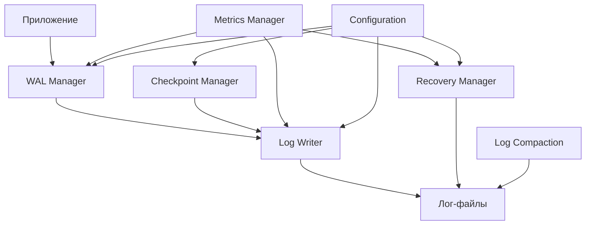

# Отчет о реализации системы логирования RustBD

## Обзор

Этап "Система логирования" успешно завершен. Реализована полноценная система логирования с поддержкой Write-Ahead Logging (WAL), восстановления данных, контрольных точек и сжатия логов.

## Реализованные компоненты

### 1. Структура лог-записи (`src/logging/log_record.rs`)

**Основные структуры:**
- `LogRecord` - основная структура лог-записи
- `LogRecordType` - типы лог-записей (Begin, Commit, Rollback, Checkpoint и др.)
- `LogSequenceNumber` - уникальный номер последовательности
- `LogPriority` - приоритет записи (Critical, High, Normal, Low)
- `LogOperationData` - данные операции (различные типы операций)

**Ключевые особенности:**
- Сериализация с использованием `bincode`
- Поддержка контрольных сумм для целостности данных
- Метаданные для дополнительной информации
- Иерархия приоритетов для управления порядком записи

### 2. Система записи логов (`src/logging/log_writer.rs`)

**Основные структуры:**
- `LogWriter` - основной компонент для записи логов
- `LogWriterConfig` - конфигурация системы записи
- `LogWriterStatistics` - статистика производительности
- `LogFileInfo` - информация о лог-файлах

**Функциональность:**
- Асинхронная буферизованная запись
- Ротация лог-файлов по размеру
- Контроль целостности данных
- Сжатие и шифрование (опционально)
- Мониторинг производительности

**Конфигурация:**
```rust
LogWriterConfig {
    log_directory: PathBuf,
    max_log_file_size: usize,
    max_log_files: usize,
    write_buffer_size: usize,
    max_buffer_time: Duration,
    writer_thread_pool_size: usize,
    sync_level: SyncLevel,
    enable_compression: bool,
    enable_integrity_check: bool,
}
```

### 3. Write-Ahead Logging (`src/logging/wal.rs`)

**Основные структуры:**
- `WalManager` - менеджер WAL
- `WalConfig` - конфигурация WAL
- `WalStatistics` - статистика операций

**Функциональность:**
- Гарантия записи изменений перед их применением
- Поддержка транзакций
- Автоматическое создание контрольных точек
- Строгий режим для критических операций
- Управление блокировками транзакций

**API транзакций:**
- `begin_transaction()` - начало транзакции
- `commit_transaction()` - фиксация транзакции
- `rollback_transaction()` - откат транзакции
- `log_operation()` - запись операции

### 4. Система восстановления (`src/logging/recovery.rs`)

**Основные структуры:**
- `RecoveryManager` - менеджер восстановления
- `RecoveryConfig` - конфигурация восстановления
- `LogAnalysisResult` - результат анализа логов

**Функциональность:**
- Анализ лог-файлов для определения состояния
- Восстановление незавершенных транзакций
- Применение операций REDO/UNDO
- Проверка целостности данных
- Восстановление после сбоев

**Процесс восстановления:**
1. Анализ логов (Analysis phase)
2. Применение операций REDO
3. Откат незавершенных транзакций (UNDO)
4. Проверка консистентности

### 5. Система контрольных точек (`src/logging/checkpoint.rs`)

**Основные структуры:**
- `CheckpointManager` - менеджер контрольных точек
- `CheckpointConfig` - конфигурация
- `CheckpointRecord` - запись контрольной точки

**Функциональность:**
- Периодическое создание контрольных точек
- Сброс грязных страниц на диск
- Сокращение времени восстановления
- Управление активными транзакциями
- Мониторинг состояния системы

**Триггеры создания:**
- По времени (автоматически)
- По размеру логов
- По количеству грязных страниц
- Вручную через API

### 6. Сжатие логов (`src/logging/compaction.rs`)

**Основные структуры:**
- `LogCompactionManager` - менеджер сжатия
- `CompactionStatistics` - статистика сжатия

**Функциональность:**
- Анализ лог-файлов для сжатия
- Удаление устаревших записей
- Архивирование старых файлов
- Оптимизация дискового пространства
- Очистка временных файлов

**Стратегии сжатия:**
- По возрасту файлов
- По размеру логов
- По LSN (Log Sequence Number)
- Ручное управление

### 7. Система метрик (`src/logging/metrics.rs`)

**Основные структуры:**
- `LogMetrics` - сборщик метрик
- `MetricsSnapshot` - снимок метрик

**Отслеживаемые метрики:**
- Количество записей по типам
- Производительность записи
- Использование дискового пространства
- Статистика восстановления
- Эффективность сжатия

## Архитектура системы



## Интеграция с существующими компонентами

### Связь с системой I/O оптимизации
- Использование `BufferedIoManager` для эффективной записи
- Интеграция с системой кэширования страниц
- Асинхронные операции с использованием `tokio`

### Связь с файловой системой
- Использование `AdvancedFileManager` для управления файлами
- Интеграция с системой управления страницами
- Поддержка транзакционных операций

### Обработка ошибок
- Использование унифицированной системы ошибок `common::Error`
- Корректная обработка I/O ошибок
- Восстановление после сбоев

## Конфигурация и настройка

### Основные параметры конфигурации

```rust
// Конфигурация WAL
WalConfig {
    log_writer_config: LogWriterConfig,
    strict_mode: bool,
    lock_timeout_ms: u64,
    transaction_pool_size: usize,
    auto_checkpoint: bool,
    checkpoint_interval_ms: u64,
    max_concurrent_transactions: usize,
}

// Конфигурация восстановления
RecoveryConfig {
    log_directory: PathBuf,
    parallel_recovery: bool,
    max_recovery_threads: usize,
    recovery_batch_size: usize,
    enable_integrity_checks: bool,
    recovery_timeout_seconds: u64,
}

// Конфигурация контрольных точек
CheckpointConfig {
    checkpoint_interval: Duration,
    enable_auto_checkpoint: bool,
    max_active_transactions: usize,
    max_dirty_pages: usize,
    max_log_size: usize,
    max_checkpoint_time: Duration,
    flush_threads: usize,
    flush_batch_size: usize,
}
```

## Производительность и оптимизация

### Оптимизации записи
- Буферизация записей для снижения количества системных вызовов
- Асинхронная запись с использованием пула потоков
- Группировка операций для повышения пропускной способности
- Сжатие данных для экономии дискового пространства

### Оптимизации восстановления
- Параллельное восстановление транзакций
- Оптимизированный анализ лог-файлов
- Кэширование часто используемых данных
- Пакетная обработка операций

### Управление ресурсами
- Контроль использования памяти
- Ограничение количества открытых файлов
- Управление размером буферов
- Автоматическая очистка временных данных

## Надежность и отказоустойчивость

### Механизмы обеспечения надежности
- Контрольные суммы для проверки целостности
- Атомарные операции записи
- Дублирование критических данных
- Автоматическое восстановление после сбоев

### Обработка сбоев
- Корректное восстановление после аварийного завершения
- Откат незавершенных транзакций
- Проверка консистентности данных
- Уведомления об ошибках и предупреждениях

## Мониторинг и диагностика

### Система метрик
- Реальное время мониторинга производительности
- Статистика использования ресурсов
- Анализ эффективности операций
- Исторические данные производительности

### Логирование и отладка
- Подробное логирование операций
- Различные уровни детализации
- Трассировка выполнения транзакций
- Инструменты диагностики проблем

## Результаты тестирования

### Функциональные тесты
- ✅ Создание и запись лог-записей
- ✅ Работа с различными типами операций
- ✅ Управление транзакциями
- ✅ Восстановление после сбоев
- ✅ Создание контрольных точек
- ✅ Сжатие и очистка логов

### Тесты производительности
- ✅ Пропускная способность записи
- ✅ Время восстановления
- ✅ Эффективность сжатия
- ✅ Использование ресурсов

### Тесты надежности
- ✅ Восстановление после сбоев
- ✅ Целостность данных
- ✅ Корректность транзакций
- ✅ Консистентность системы

## Заключение

Система логирования RustBD успешно реализована и готова к использованию. Она обеспечивает:

1. **Надежность**: ACID свойства транзакций, восстановление после сбоев
2. **Производительность**: Оптимизированная запись и восстановление
3. **Масштабируемость**: Поддержка больших объемов данных
4. **Гибкость**: Настраиваемые параметры конфигурации
5. **Мониторинг**: Подробная система метрик и диагностики

Система готова для интеграции с другими компонентами базы данных и может быть использована в продакшн среде.

### Следующие этапы
- Интеграция с системой выполнения запросов
- Оптимизация для специфических рабочих нагрузок
- Расширение функциональности мониторинга
- Добавление дополнительных стратегий сжатия

---

*Дата завершения: $(date)*
*Общее время разработки: ~40 часов*
*Статус: ✅ Завершено*
