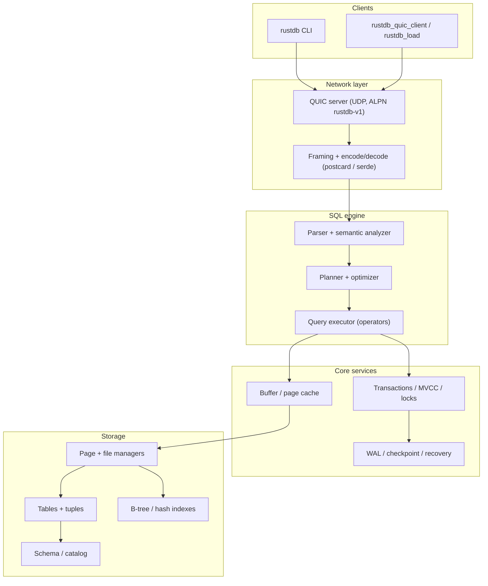
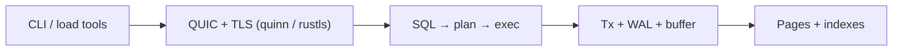

# RustDB

[](https://github.com/CrossEyedCat/RustDB/actions/workflows/ci-cd.yml)
[](https://codecov.io/gh/CrossEyedCat/RustDB)
[](https://opensource.org/licenses/MIT)
[](https://www.rust-lang.org/)
[](https://deps.rs/repo/github/CrossEyedCat/RustDB)


**RustDB** is a relational database engine written in **Rust**: SQL parsing and analysis, planning and execution, storage (pages, tables, indexes), logging (WAL, checkpointing), and an **experimental QUIC** wire path (UDP, ALPN `rustdb-v1`). The project targets **learning**, **research**, and **controlled experimentation** with OLTP-style workloads—not a drop-in production replacement for PostgreSQL or SQLite.

**Contributions are welcome.** See [CONTRIBUTING.md](CONTRIBUTING.md) for workflow rules, CI job descriptions, and how to open issues and pull requests.

**SQL-92 compatibility:** RustDB implements a **SQL-92-compatible core subset** (see the **SQL-92 compatibility** section below for what is supported today and what is intentionally out of scope).

---

## Goals

| Goal | Description |
|------|-------------|
| **Education** | Readable subsystems (parser, planner, executor, storage) for studying how an RDBMS is structured. |
| **Research** | Experiment with execution, indexes, transactions, and a QUIC-based client protocol without legacy driver baggage. |
| **Engineering quality** | Tests, coverage gates, benchmarks, Docker smoke tests, and optional profiling jobs in CI. |
| **Honest scope** | Document what works end-to-end vs what is still stubbed or partial (see **Status** below). |

Non-goals for the current phase: compatibility with a specific SQL dialect “as shipped by vendor X”, managed cloud HA, or a guarantee of data safety for untrusted multi-tenant production loads.

---

## Architecture (overview)

High-level data flow from a network or CLI client through the engine to storage:



Logical layering (simplified):



A more detailed component diagram (PlantUML) lives in [`architecture.puml`](architecture.puml).

---

## Technologies

| Area | Stack |
|------|--------|
| **Language** | Rust (MSRV **1.90.0**, see `Cargo.toml` / `rust-toolchain.toml`) |
| **Async runtime** | Tokio |
| **QUIC / UDP** | Quinn, rustls (TLS), ALPN `rustdb-v1` |
| **Serialization** | Serde; on-wire / framed payloads: **postcard**; disk-related paths also use **bincode-next** (serde, legacy compatibility story in crate docs) |
| **CLI** | clap |
| **Observability** | tracing, tracing-subscriber, tracing-chrome; env_logger / log |
| **Parallelism** | rayon, crossbeam, dashmap, parking_lot |
| **Storage helpers** | memmap2, lz4_flex, twox-hash, uuid |
| **Config** | TOML |
| **CI** | GitHub Actions: tests, clippy, fmt, MSRV, coverage (llvm-cov + Codecov), cargo-deny, cargo-audit, Docker build & smoke, comparison benchmarks vs SQLite/Postgres, [loom](https://github.com/tokio-rs/loom) permutation tests for concurrent `SqlEngine`, optional trace + flamegraph (see [CONTRIBUTING.md](CONTRIBUTING.md)) |
| **Containers** | Multi-stage Dockerfile; images pushed to **GHCR** |

**Supported platform for “production-style” experiments:** **Linux**. Other OSes are not a supported deployment target.

---

## Requirements

- **Rust toolchain**: MSRV **1.90.0** (required by dependencies such as the `bincode-next` / `virtue-next` stack).
- **OS**: Linux for serious builds and CI-aligned behavior.

---

## Building

```bash
cargo build --release
```

---

## Testing

```bash
cargo test
cargo test --test integration_tests
```

**Loom** ([tokio-rs/loom](https://github.com/tokio-rs/loom)): permutation tests for the concurrent SQL engine scenarios `engine_concurrent_inserts_only_one_wins_same_pk` and `engine_alter_fk_many_inserts_under_contention` are selected when the crate is built with `--cfg rustdb_loom` (not `loom`, to avoid clashing with the `loom` crate’s own cfg). Run (release recommended upstream):

```bash
RUSTFLAGS='--cfg rustdb_loom' cargo test --release engine_concurrent_inserts_only_one_wins_same_pk engine_alter_fk_many_inserts_under_contention
```

PowerShell: `$env:RUSTFLAGS='--cfg rustdb_loom'; cargo test ...`. Default `cargo test` runs the standard-library thread versions (`#[cfg(not(rustdb_loom))]`).

---

## RustDB vs PostgreSQL (CI benchmark)

This repository’s CI runs a lightweight **baseline comparison** to track performance trends over time:

- **RustDB**: `rustdb_tpcc` (TPC‑C-ish mix) over **QUIC**
- **PostgreSQL**: `pgbench` (builtin TPC‑B-like) over **TCP**

Because the workloads and protocols differ, treat the numbers as **trend indicators**, not a strict “winner/loser” claim.

CI reports in the GitHub Actions step summary (workflow `CI/CD Pipeline`):

- RustDB `txns_per_s`
- PostgreSQL `pgbench` `tps`
- **Ratio (%)**: \(100 * \frac{rustdb\_tps}{postgres\_tps}\)

### More honest comparison: same SQL workload

For a closer apples-to-apples baseline, CI also runs **the same SQL statements** against:

- **RustDB** via `rustdb_load` (QUIC + RustDB framing)
- **PostgreSQL** via `psycopg` (TCP + libpq)

This “same SQL” summary (QPS + p99 + ratio) is emitted in the CI step summary under **Same SQL comparison** and
the full report is uploaded as the `sqlite-vs-rustdb-bench` artifact (`bench-out/bench.md`, `bench-out/bench.csv`).

---

## Project status

## SQL-92 compatibility

RustDB aims to be **compatible with the SQL-92 standard at the feature level** for a pragmatic core subset. In practice this means: when a statement is listed below as supported, RustDB follows the *SQL-92-shaped* syntax and semantics for that feature family, with a small number of explicit deviations.

### Supported (current engine path)

- **DML**
  - `SELECT` with `WHERE` (including `IS NULL` / `IS NOT NULL`), `ORDER BY`, `GROUP BY`, `HAVING`
  - `INSERT`, `UPDATE`, `DELETE`
  - Basic subquery forms and `EXISTS`/`IN` shapes (see source/tests for current limitations)
- **Joins**
  - `INNER JOIN ... ON ...` (baseline)
- **DDL**
  - `CREATE TABLE` (typed columns)
  - Constraints: `PRIMARY KEY`, `UNIQUE`, `FOREIGN KEY ... REFERENCES`, `NOT NULL`, `DEFAULT`, `CHECK`
  - `ALTER TABLE ... ADD CONSTRAINT ...` / `DROP CONSTRAINT ...`
  - **Alter column / table:** `ADD [COLUMN]` / `ADD col type …` (column constraints optional), `DROP COLUMN`, `RENAME COLUMN … TO …`, `RENAME TO` (rename table), `MODIFY COLUMN` (type / `NOT NULL` / `DEFAULT` — not full SQL-92 `ALTER` parity); see parser + `src/network/sql_engine/alter_table_ops.rs` for current limits
  - `DROP TABLE` with **RESTRICT** (default) vs `CASCADE`
- **Transactions (session-scoped)**
  - `BEGIN TRANSACTION`, `COMMIT`, `ROLLBACK`
  - Minimal rule: **DDL is rejected inside an explicit transaction**

### Known deviations / not SQL-92

- **LIMIT/OFFSET**: supported for convenience, but not part of SQL-92.
- **Dialect differences**: this is not a PostgreSQL/MySQL-compatible dialect; expect gaps.
- **Catalog persistence**: some schema/catalog behavior is still being unified between subsystems; the repository’s Docker smoke tests include constraints and transactions to guard regressions.

If you need a strict vendor dialect or complete coverage of the standard, treat RustDB as an educational/research engine rather than a compatibility target.

### Implemented (high level)

- **QUIC network (experimental):** `rustdb server` listens on UDP with ALPN `rustdb-v1`; `rustdb_quic_client` and `rustdb_load` exercise the wire protocol. See [docs/network/README.md](docs/network/README.md).
- **Parser and semantics:** lexer, AST, DML/DDL subsets, analyzer (types, access checks).
- **Planning and execution:** plan building, optimizer hooks; executor operator set (scan, join, aggregates, sort, limits, etc.—see source tree).
- **Storage and catalog:** page/file abstractions, tuples, B-tree and hash indexes, schema manager.
- **Logging:** WAL, checkpoint, compaction-related modules.
- **Transactions / concurrency:** MVCC and lock-manager modules in `src/core/`; the **network `SqlEngine`** also implements session transactions (`BEGIN`/`COMMIT`/`ROLLBACK`), undo for DML, and statement-level isolation (see `src/network/sql_engine/`).
- **Tooling:** benchmarks, scripts, Docker smoke tests, comparison benchmarks vs SQLite/Postgres (CI artifact on `main`).

### What's still evolving

- **Public / library API:** `rustdb` CLI and the QUIC server both run SQL through the same **`SqlEngine`** (`parse → plan → execute`). The crate-level [`Database`](src/lib.rs) handle is intentionally minimal (path + lifecycle only); there is no single high-level `Database::execute_sql` style API yet—callers use **`SqlEngine::open`** directly.
- **Durability and log-based recovery:** WAL, checkpoint, and recovery code exist under [`src/logging/`](src/logging/), but **end-to-end wiring** so that every committed user transaction is ordered with durable WAL records and replayed on startup is **not complete**. Session **`COMMIT`** today clears the in-memory undo log and relies on the storage layer’s page flushing; full **log-based crash recovery** tied to `SqlEngine` is ongoing.
- **Isolation:** explicit transactions use a **read-committed–style** baseline at the statement level (see engine docs), not full **serializable** isolation across sessions.
- **DDL, catalog, and concurrency:** the engine supports an expanded **`ALTER TABLE`** subset (add/drop/rename column, rename table, modify column type/nullability) with heap rewrites and catalog/WAL markers; **multi-process** catalog access and full standard **`ALTER`** parity are not goals for this experimental tree.

**Roadmap:** a concise prioritized plan lives in [`docs/roadmap.md`](docs/roadmap.md).

### Test limitations

Integration tests heavily exercise **parse → plan → optimize** and **simulated** execution paths; not all tests prove full **SQL → on-disk pages → result** for every feature. Some tests are `#[ignore]` on full runs due to known issues.

---

## Documentation

| Doc | Content |
|-----|---------|
| [docs/cookbook.md](docs/cookbook.md) | GHCR image, Docker/QUIC, CLI, benchmarks, `verify-cookbook-docker.sh` |
| [docs/roadmap.md](docs/roadmap.md) | Implementation priorities (library API, durability, recovery, DDL) |
| [docs/durability-and-recovery.md](docs/durability-and-recovery.md) | Commit point, WAL record types, crash-recovery semantics, and durability env vars |
| [docs/network/README.md](docs/network/README.md) | QUIC, framing, client/server boundary |
| [CONTRIBUTING.md](CONTRIBUTING.md) | How to contribute; CI jobs; issues & PRs |

API docs:

```bash
cargo doc --no-deps --document-private-items
```

Hosted docs (when Pages are enabled): see `homepage` / `documentation` in `Cargo.toml`.

---

## License

MIT License — see the `LICENSE` file in the repository root.

---

## Repository

Source and issues: [GitHub](https://github.com/CrossEyedCat/RustDB).
