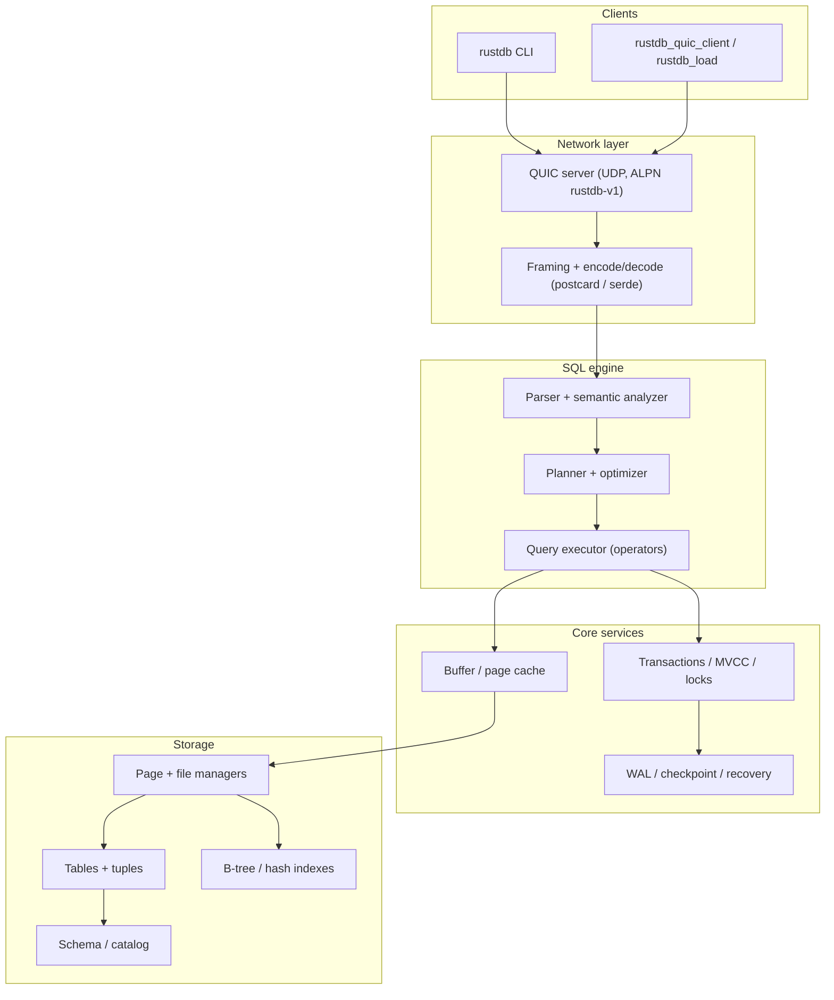
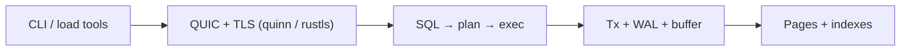

# RustDB

[](https://github.com/CrossEyedCat/RustDB/actions/workflows/ci-cd.yml)
[](https://codecov.io/gh/CrossEyedCat/RustDB)
[](https://opensource.org/licenses/MIT)
[](https://www.rust-lang.org/)
[](https://deps.rs/repo/github/CrossEyedCat/RustDB)


**RustDB** is a relational database engine written in **Rust**: SQL parsing and analysis, planning and execution, storage (pages, tables, indexes), logging (WAL, checkpointing), and an **experimental QUIC** wire path (UDP, ALPN `rustdb-v1`). The project targets **learning**, **research**, and **controlled experimentation** with OLTP-style workloads—not a drop-in production replacement for PostgreSQL or SQLite.

**Contributions are welcome.** See [CONTRIBUTING.md](CONTRIBUTING.md) for workflow rules, CI job descriptions, and how to open issues and pull requests.

---

## Goals

| Goal | Description |
|------|-------------|
| **Education** | Readable subsystems (parser, planner, executor, storage) for studying how an RDBMS is structured. |
| **Research** | Experiment with execution, indexes, transactions, and a QUIC-based client protocol without legacy driver baggage. |
| **Engineering quality** | Tests, coverage gates, benchmarks, Docker smoke tests, and optional profiling jobs in CI. |
| **Honest scope** | Document what works end-to-end vs what is still stubbed or partial (see **Status** below). |

Non-goals for the current phase: compatibility with a specific SQL dialect “as shipped by vendor X”, managed cloud HA, or a guarantee of data safety for untrusted multi-tenant production loads.

---

## Architecture (overview)

High-level data flow from a network or CLI client through the engine to storage:



Logical layering (simplified):



A more detailed component diagram (PlantUML) lives in [`architecture.puml`](architecture.puml).

---

## Technologies

| Area | Stack |
|------|--------|
| **Language** | Rust (MSRV **1.90.0**, see `Cargo.toml` / `rust-toolchain.toml`) |
| **Async runtime** | Tokio |
| **QUIC / UDP** | Quinn, rustls (TLS), ALPN `rustdb-v1` |
| **Serialization** | Serde; on-wire / framed payloads: **postcard**; disk-related paths also use **bincode-next** (serde, legacy compatibility story in crate docs) |
| **CLI** | clap |
| **Observability** | tracing, tracing-subscriber, tracing-chrome; env_logger / log |
| **Parallelism** | rayon, crossbeam, dashmap, parking_lot |
| **Storage helpers** | memmap2, lz4_flex, twox-hash, uuid |
| **Config** | TOML |
| **CI** | GitHub Actions: tests, clippy, fmt, MSRV, coverage (llvm-cov + Codecov), cargo-deny, cargo-audit, Docker build & smoke, comparison + saturation benchmarks vs SQLite/Postgres, optional trace + flamegraph (see [CONTRIBUTING.md](CONTRIBUTING.md)) |
| **Containers** | Multi-stage Dockerfile; images pushed to **GHCR** |

**Supported platform for “production-style” experiments:** **Linux**. Other OSes are not a supported deployment target.

---

## Requirements

- **Rust toolchain**: MSRV **1.90.0** (required by dependencies such as the `bincode-next` / `virtue-next` stack).
- **OS**: Linux for serious builds and CI-aligned behavior.

---

## Building

```bash
cargo build --release
```

---

## Testing

```bash
cargo test
cargo test --test integration_tests
```

---

## Project status

### Implemented (high level)

- **QUIC network (experimental):** `rustdb server` listens on UDP with ALPN `rustdb-v1`; `rustdb_quic_client` and `rustdb_load` exercise the wire protocol. See [docs/network/README.md](docs/network/README.md).
- **Parser and semantics:** lexer, AST, DML/DDL subsets, analyzer (types, access checks).
- **Planning and execution:** plan building, optimizer hooks; executor operator set (scan, join, aggregates, sort, limits, etc.—see source tree).
- **Storage and catalog:** page/file abstractions, tuples, B-tree and hash indexes, schema manager.
- **Logging:** WAL, checkpoint, compaction-related modules.
- **Transactions / concurrency:** MVCC and lock-manager modules (see **In progress** for full wiring).
- **Tooling:** benchmarks, scripts, Docker smoke tests, comparison benchmarks vs SQLite/Postgres (CI artifact on `main`).

### In progress / gaps

- **Single coherent “open database → run SQL” path** through the main server and public API is still being unified (parts of CLI/QUIC integration remain stubs or partial).
- **ACID and recovery:** ongoing integration of WAL on commit, undo, isolation, log-based recovery.
- **DDL / storage edge cases:** e.g. richer ALTER/DROP, deeper concurrent access stories.

### Test limitations

Integration tests heavily exercise **parse → plan → optimize** and **simulated** execution paths; not all tests prove full **SQL → on-disk pages → result** for every feature. Some tests are `#[ignore]` on full runs due to known issues.

---

## Documentation

| Doc | Content |
|-----|---------|
| [docs/cookbook.md](docs/cookbook.md) | GHCR image, Docker/QUIC, CLI, benchmarks, `verify-cookbook-docker.sh` |
| [docs/network/README.md](docs/network/README.md) | QUIC, framing, client/server boundary |
| [CONTRIBUTING.md](CONTRIBUTING.md) | How to contribute; CI jobs; issues & PRs |

API docs:

```bash
cargo doc --no-deps --document-private-items
```

Hosted docs (when Pages are enabled): see `homepage` / `documentation` in `Cargo.toml`.

---

## License

MIT License — see the `LICENSE` file in the repository root.

---

## Repository

Source and issues: [GitHub](https://github.com/CrossEyedCat/RustDB).
