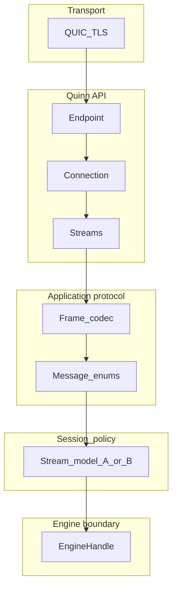

# Network architecture

## Goals

- Expose RustDB to remote clients over a **single well-defined protocol**: QUIC + application framing + engine API.
- Keep **concerns separated**: encryption and transport (QUIC/TLS), session/stream policy, frame codec, and SQL execution (parser, planner, executor, storage).
- Allow **incremental implementation**: a minimal v1 can return stubbed results while the framing and quinn integration are real.

## Non-goals

- Replacing or emulating the PostgreSQL wire protocol.
- Defining replication or cluster networking (future work).

## Layered model

The stack is strictly ordered from wire to core:

### 1. Transport (QUIC + TLS 1.3)

QUIC provides encrypted connections, version negotiation, loss recovery, and **multiple independent bidirectional streams** per connection. RustDB does not implement TLS or UDP details directly; **[quinn](https://github.com/quinn-rs/quinn)** maps QUIC to Rust APIs (`Endpoint`, `Connection`, `SendStream` / `RecvStream`).

### 2. Quinn layer

- **Server:** bind a UDP socket, create a `quinn::Endpoint`, accept **incoming connections**, and spawn tasks per connection or per stream (policy in [stream-models.md](stream-models.md)).
- **Client:** dial the server, obtain a `Connection`, open streams according to the chosen stream model.

### 3. Application framing

Every logical message is a **frame**: header (magic, protocol version, payload length) + **serde**-encoded body. See [framing.md](framing.md). This layer is independent of QUIC: the same bytes could be tested over in-memory channels.

### 4. Session / stream policy

How many QUIC streams are used and how queries are mapped to them is an **open decision** between two documented options; see [stream-models.md](stream-models.md).

### 5. Engine boundary

Decoded requests become calls to an **engine handle** (trait): SQL string in, structured result or error out. The network layer must not embed SQL parsing logic; see [engine-boundary.md](engine-boundary.md).

## Relationship to existing code

| Location | Role |
|----------|------|
| [`src/network/server.rs`](../../src/network/server.rs) | Intended home for QUIC server endpoint, config (`ServerConfig`), and accept loop. |
| [`src/network/connection.rs`](../../src/network/connection.rs) | May evolve into per-connection state, timeouts, or pool integration; aligns with quinn `Connection`. |
| [`src/lib.rs`](../../src/lib.rs) `Database` | Future owner of catalog, buffers, WAL; network server receives a handle that ultimately uses `Database` (or a thin facade). |

## Operational boundaries

- **Network process:** I/O, framing, per-stream timeouts, backpressure on QUIC streams, optional connection limits (see [quic-and-quinn.md](quic-and-quinn.md)).
- **Engine process (library):** correctness of SQL, transactions, and storage; resource limits may be enforced in both layers (e.g. max result rows at the protocol, buffer pool at the engine).
