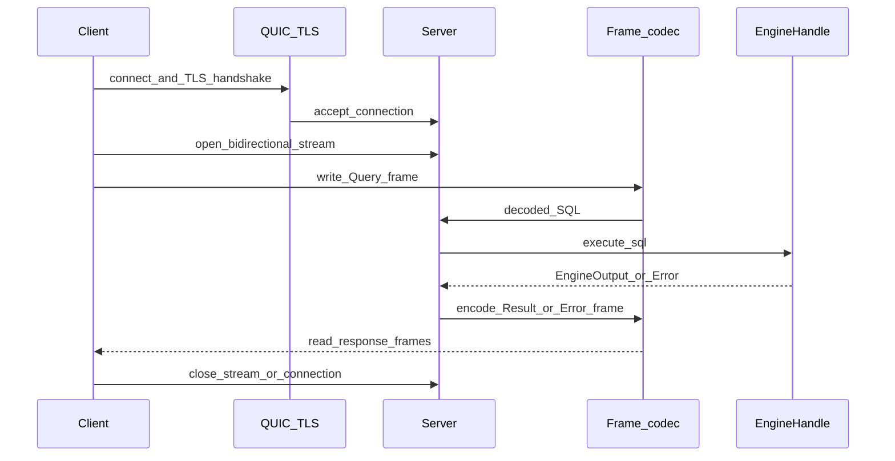
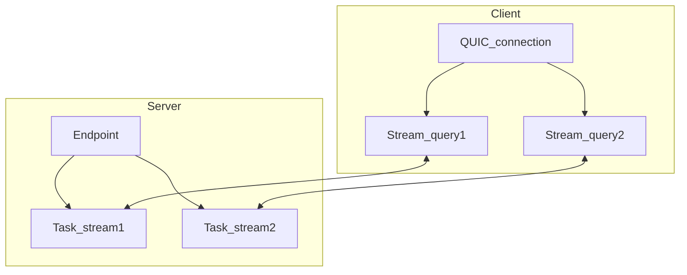
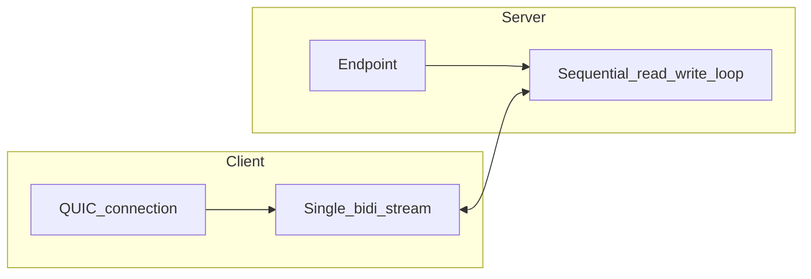
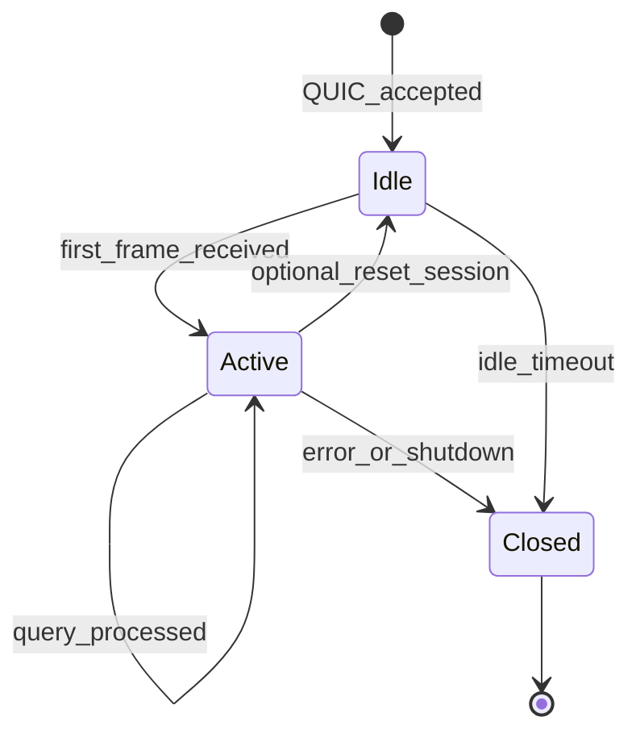
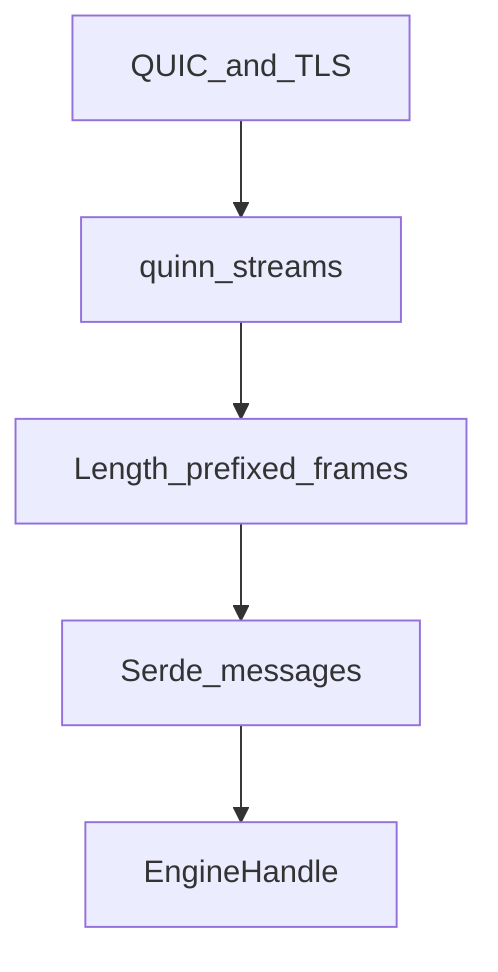

# Diagrams

Mermaid diagrams for the QUIC network layer. GitHub and many Markdown viewers render these inline.

## Sequence: connect, query, response

Typical flow after stream model is chosen (one bidirectional stream shown for simplicity).

## Topology: Variant A (multi-stream)

## Topology: Variant B (single REPL stream)

## Session-oriented connection state (conceptual)

Optional state machine for a **logical** session; actual storage may live in `Connection` or task-local data.

## Layer stack (compact)

See also [architecture.md](architecture.md) for the full layered description.
