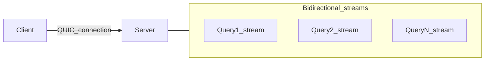

# QUIC stream models

RustDB may use QUIC in more than one way. This document defines **two** candidate topologies for mapping **sessions and queries** to QUIC streams.

**Implementation choice (2025-03-25):** **Variant A** — one connection, many bidirectional streams (see `src/network/query_stream.rs` and `QuicServer::run`).

## Variant A: One connection, many bidirectional streams

**Model:** Each client holds **one** QUIC `Connection`. Each **query** (or transaction scope) uses a **new bidirectional stream**: request frames on the send half, response frames on the receive half. When the query completes, the stream is closed.

### Pros

- **Parallel queries** on one connection without multiplexing logic in the application (QUIC handles interleaving).
- **Natural cancellation:** reset or stop the stream to abort one query without tearing down the whole connection.
- **Backpressure** per query if reads/writes block on each stream independently.

### Cons

- More **server tasks** (one per active stream) and more careful **resource accounting** (limit concurrent streams per connection).
- Slightly more complex **client API** (open stream per query).

### Typical use

OLTP-style workloads with concurrent statements from one client.

---

## Variant B: One connection, one long-lived bidirectional stream

**Model:** After connect, client opens **one** bidirectional stream (or uses the first available stream) and sends **sequential** request/response exchanges on it (REPL-style: send frame, read frame, repeat).

### Pros

- **Simplest** server and client loop: single read/write pair per connection.
- Easier to **reason about ordering** (strictly sequential).

### Cons

- **Head-of-line blocking** at the application level: a long-running query delays subsequent ones on the same stream.
- No **parallel** queries on one connection without adding another mechanism.

### Typical use

Early prototypes, tooling, or clients that never issue overlapping queries.

---

## Comparison

| Aspect | Variant A (multi-stream) | Variant B (single stream) |
|--------|---------------------------|----------------------------|
| Parallel queries per connection | Yes | No |
| Implementation complexity | Higher | Lower |
| Stream-level cancel | Straightforward | Affects all queued work on that stream |
| Natural fit for HTTP/3 mental model | Yes | No |

## Recommendation (non-binding)

- For a **database** with concurrent sessions from a single client, **Variant A** is usually a better long-term fit.
- For a **minimal first prototype**, **Variant B** may be faster to ship; the framing layer in [framing.md](framing.md) is identical—only stream allocation policy changes.

## Decision

Variant **A** is implemented: each new client-initiated bidirectional stream carries one request frame and one response frame; concurrent streams per connection are limited by configuration (`ServerConfig::max_concurrent_streams_per_connection` + QUIC transport `max_concurrent_bidi_streams`).
